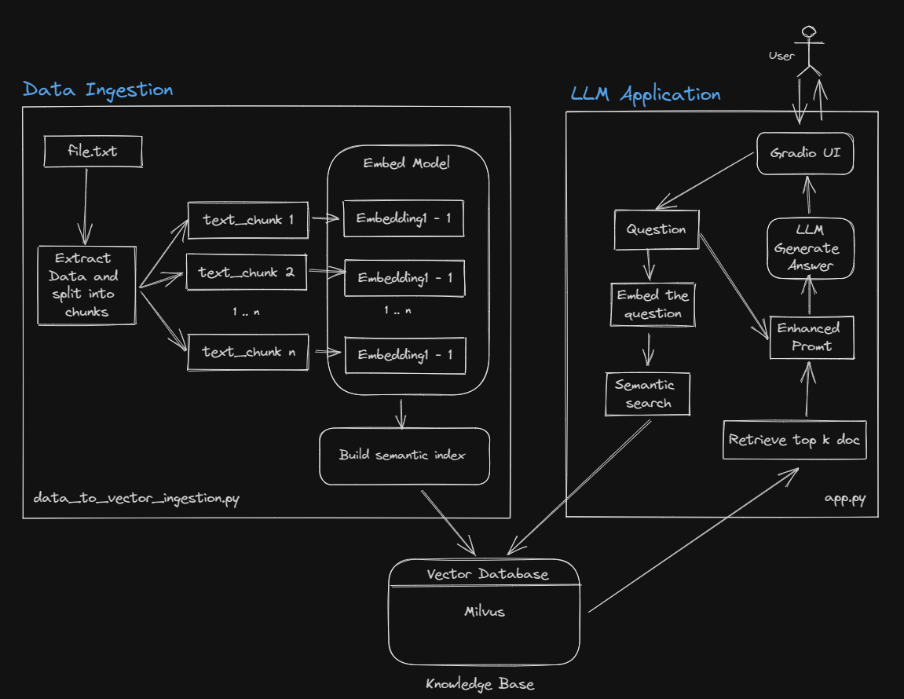
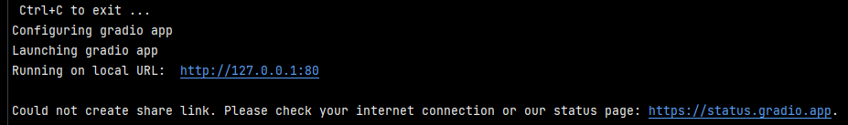
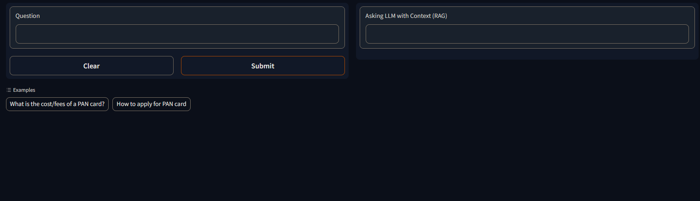
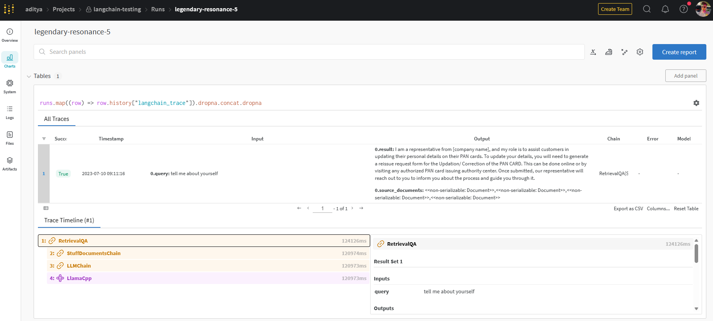

# Local Chatbot (CPU)

The project aims to run a LLM based question answering chatbot on enterprise/private data using CPU only.

You can ask questions to your private txt documents without an internet connection, using opensource LLM.

Note: This project is using a quantized LLM model which designed to run on cpu only, therefore the performance may not be upto SOTA llm (falcon or similar) model and speed will be a bit slow based on you cpu compute availability.

#### Approach


#### Built with 
- [LangChain](https://docs.langchain.com/docs/) 
- [Milvus](https://milvus.io/)  Vector Database for embedding storage
- [InstructorEmbeddings](https://instructor-embedding.github.io/) - For vector embedding of docs
- [llamacpp](https://pypi.org/project/llamacpp/) - LLM model
- [Gradio](https://www.gradio.app/) - Web interface
- [W&B](https://docs.wandb.ai/guides/integrations/langchain) - For prompt/experiment tracking 

Environment Setup
---

Install conda and create an environment
```shell
conda create -n localChatbot python=3.9
```
```shell
conda activate localChatbot
```

In order to set your environment up to run the code here,  install all requirements:

```shell
pip install -r requirements.txt
```

#### (Important) Before moving forward you should have a Milvus instance up and running. - 
[Milvus database setup guide](https://milvus.io/docs/v2.1.x/install_standalone-docker.md)

Running up the application
---
### Data ingestion
Below command will automatically load the embedding model and save the vector embeddings of txt file present in `data/` directory

```shell
python data_to_vector_ingestion.py 
```

### LLM Application UI
It will start a gradio prediction instance.

```shell
python app.py 
```

It may also ask for your W&B api key. Please go through the guide mentioned in the terminal.
#### terminal output -

Now you can access the LLM app from your localhost -
* Navigate to the address mentioned in the terminal and start asking the questions to your chatbot.

Screenshot
---

### Gradio App

### W&B Experiment Logs


Performance Evaluation 
---
* Using weights and bias to keep track for all the prompts results and manually checking the output’s performance
* Using BertScore as a performance metric


---
Author [@adityaadarsh](https://www.linkedin.com/in/aditya-adarsh-657320188/)

